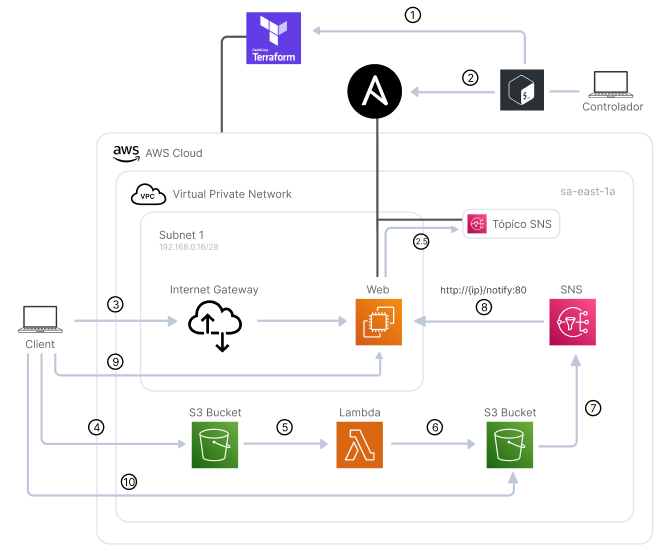
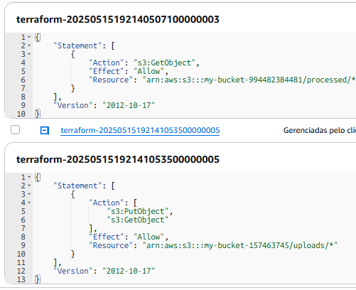
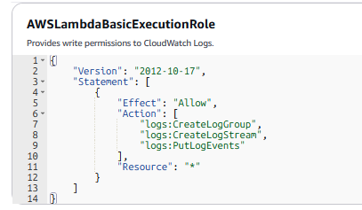
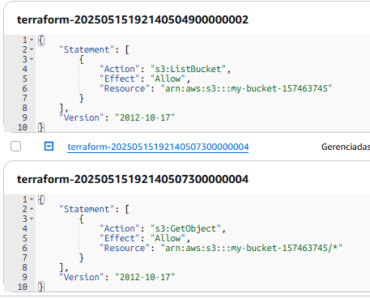
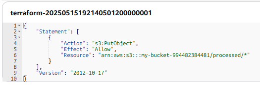
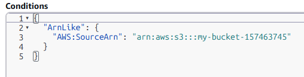
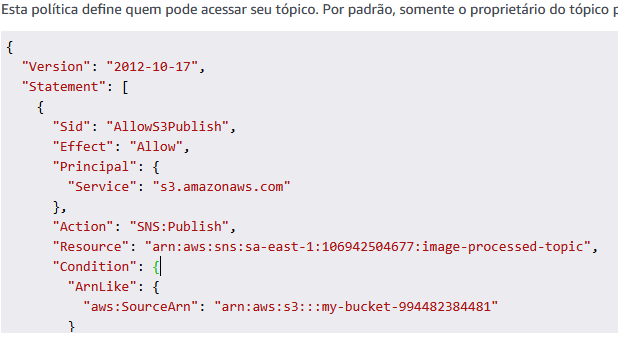

<h1>Objetivo</h1>

Automatizar o provisionamento e configuração de toda infraestrutura da nuvem AWS necessaria para o projeto
a partir de um unico script shell usando Terraform e Ansible.

 
<h1>Projeto</h1>

Fluxo que autentica, recebe, processa e devolve a imagem processada ao usuário para download.

 
<h1>Ferramentas</h1>

- Bash shell
- Terraform
- Ansible
- Docker
- NodeJs (EC2 & Lambda)

 
<h1>Desafios</h1>

- Lidar com permissoes: Ao criar a ec2, foi necessario instalar
aws-cli via ansible nela para inscreve-la no topico SNS, e com isso
a prioridade de permissoes passa a ser as credenciais da aws-cli local
e não da instance profile, portanto, foi necessario lembrar de excluir
as credenciais após o uso delas via ansible (ultimas tasks).

- Lidar com o fato de que as dependencias necessarias para o 
codigo da Lambda devem ser instaladas em um sistema operacional
compativel com o amazon linux x64 quando nao utilizando lambda layers
para as depenedencias, a solução usada foi subir uma ec2 com o mesmo
sistema operacional, instalar as dependencias e fazer uso de SCP para
transferencia.

 
<h1>Arquitetura Gerada</h1>

- 1 & 2 - Gera e configura os recursos.
- 2.5 - EC2 se inscreve no tópico SNS.
- 3 - Autenticação e pre-signed-PUT-URL para Bucket 1.
- 4 - Upload para Bucket 1.
- 5 - Bucket 1 notifica Lambda que inicia o processamento, no caso redimensiona e adiciona filtro cinza à imagem.
- 6 - Armazena imagem processada em Bucket 2.
- 7 - Bucket 2 dispara SNS.
- 8 - SNS notifica EC2 do evento.
- 9 - Cliente faz polling para se informar sobre status e quando finalizado requisita pre-signed-GET-URL para Bucket 2.
- 10 - Cliente tem acesso a imagem processada armazenada em Bucket 2 para visualização e download.

 
<h1>Recursos Gerados</h1>

- 1 VPC (192.168.0.0/24).
- 1 Subnet (192.168.0.0/28).
- 1 Internet Gateway.
- 1 Tabela de roteamento.
- 1 IPv4 elastíco público.
- 1 EC2
- 1 Security group
- 2 S3 Buckets
- 1 Lambda
- 1 SNS Topic

 
<h1>Demo - GUI</h1>

[demo-gui.webm](./demo-videos/demo-gui.webm)

 
<h1>Demo - Construindo e Configurando a Infraestrutura</h1>

[demo-terraformar.mov](./demo-videos/demo-terraformar.mov)

 
<h1>Demo - Destruindo a Infraestrutura</h1>

[demo-desterraformar.mov](./demo-videos/demo-desterraformar.mov)

 
<h1>Permissões</h1>
<h2>EC2 Instance Profile attached em Policy<h2>

Permitir gerar pre-signed URLs para getObject (Bucket 1) e PutObject (Bucket 2)

<h2>Lambda Policy attached em Role<h2>

Permitir Lambda listBucket & getObject (Bucket 1) e PutObject (Bucket 2)

<h2>Lambda Resource Based Policy<h2>

Permitir S3 Bucket 1 disparar Lambda (Attached em lambda)

<h2>SNS Resource Based Policy<h2>

Permitir S3 Bucket 2 disparar SNS (Attached em SNS)

	

 
<h1>Notas para rodar</h1>

<h2>Credenciais</h2>

Variaveis de ambiente AWS (client id e secret) foram armazenadas em ~/.bashrc.

Politicas usadas pelo controlador em /static/permissions/controller-node/

<h2>Lambda</h2>

um arquivo nodejs-image-processing.zip contendo as dependencias deve estar em /terraform/

<h2>Mais</h2>
Os seguintes arquivos e caminhos são construídos a partir do script shell e estão contidos nesse repositório apenas para demonstração:
  

- /home/{user}/.ssh/config
- ./ansible/inventory.ini
- ./ansible/playbook.yml

  
